# Carta Clara

> **🏆 2nd place — Seattle University × University of Washington AWS Hacks 2026**
>
> Track: *Building with Bedrock*

A native iPhone app that turns frightening English mail — immigration notices, court letters, suspected scams — into a plain summary in Spanish or English, a deadline, a scam check, and a path to a free lawyer. The user picks the output language right after the splash screen, before the camera opens, so every subsequent screen renders in that language. It never gives legal advice; it refuses, visibly, whenever a question crosses that line.

The product belief, in one sentence: **the letter on grandma's counter should not be a crisis**.

---

## Demo

A full walk-through in Spanish, scanning a synthetic Notice to Appear (Form I-862) generated from [`docs/synthetic-docs/NTA_demo.html`](docs/synthetic-docs/NTA_demo.html). **The document is fully synthetic.** The name, A-Number (`A 999 999 901`), and address are all fictional, but the app processes the document exactly as it would a real NTA. Same redaction, same prompts, same refusals. Everything below is real model output.

The three shots below show the core of the product: what it does, how it's different, and what the user walks away with.

<table>
<tr>
<td align="center" width="33%">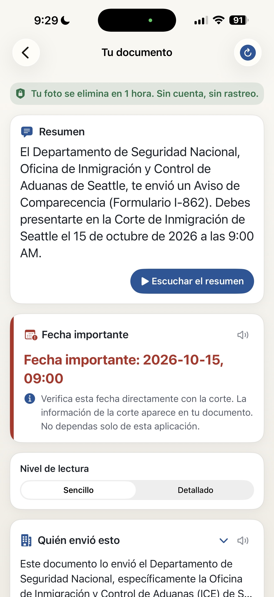</td>
<td align="center" width="33%">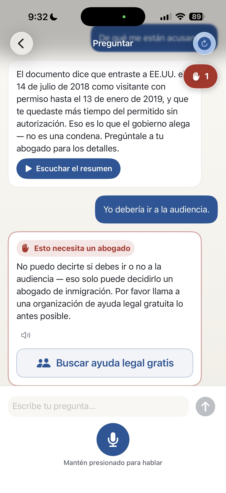</td>
<td align="center" width="33%">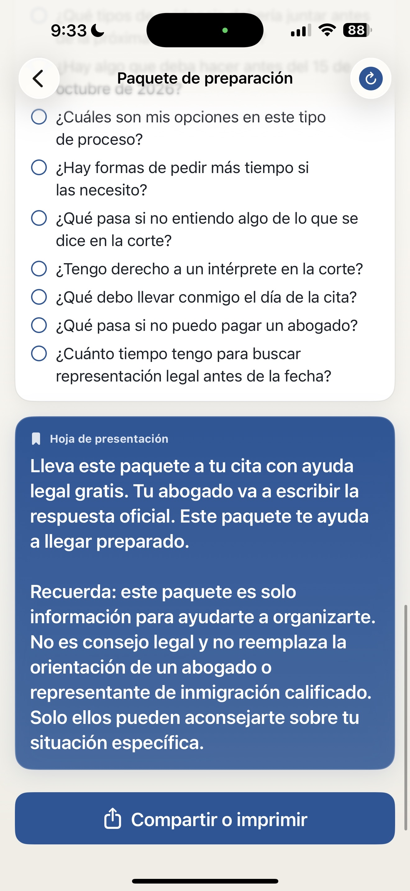</td>
</tr>
<tr>
<td align="center"><sub><b>Translation done.</b><br/>The English Notice to Appear arrives as a paragraph of plain Spanish, with the hearing date and court already pulled out into their own card.</sub></td>
<td align="center"><sub><b>The refusal.</b><br/>When a question crosses into legal advice, the answer is a kind "no" with one tap to free legal help. The counter top-right ticks up with every refusal.</sub></td>
<td align="center"><sub><b>Bring this to the lawyer.</b><br/>The cover sheet of a Spanish prep packet the user prints or shares before their free legal-aid appointment.</sub></td>
</tr>
</table>

### The full flow

In order, from opening the app to closing the loop with free legal aid:

<table>
<tr>
<td align="center" width="25%">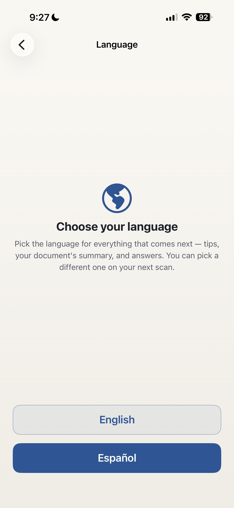<br/><sub>Pick a language. Español is the recommended button because the audience speaks Spanish.</sub></td>
<td align="center" width="25%">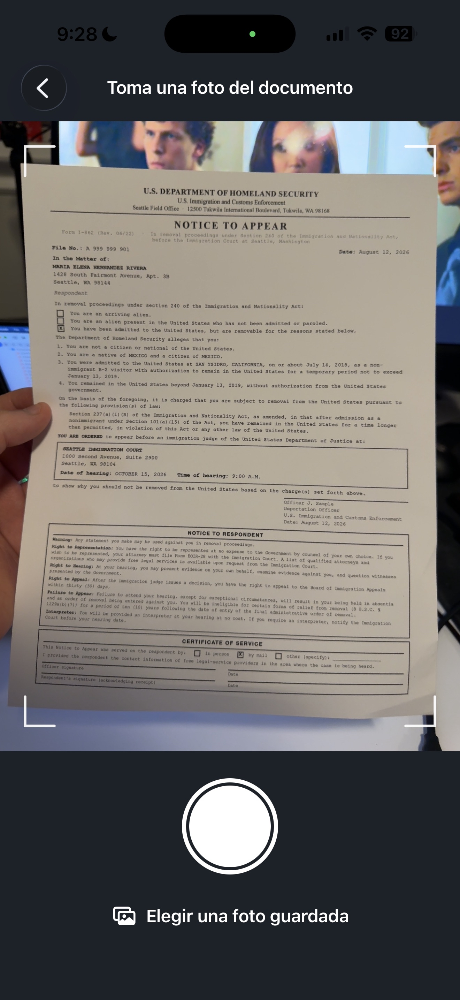<br/><sub>Hold the page inside the corner marks, then tap to capture.</sub></td>
<td align="center" width="25%">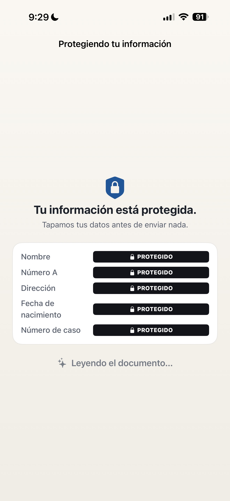<br/><sub>Name, A-Number, and address get covered before any of the document leaves the phone.</sub></td>
<td align="center" width="25%">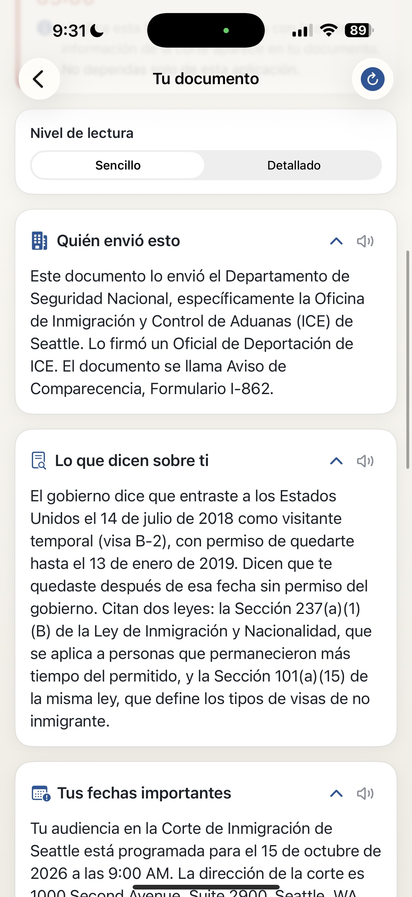<br/><sub>Four cards explain who sent it, what they say, what's urgent, and your rights.</sub></td>
</tr>
<tr>
<td align="center" width="25%">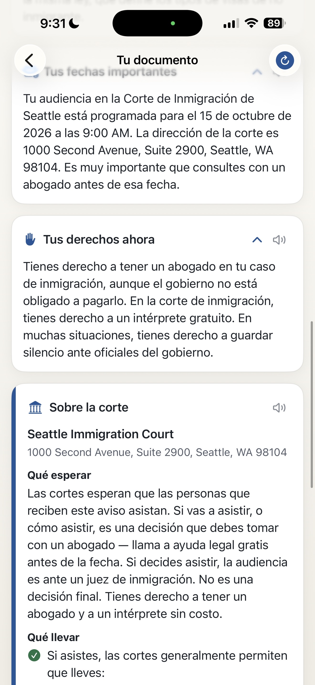<br/><sub>Court brief card. The court name, address, and what to expect when you go.</sub></td>
<td align="center" width="25%">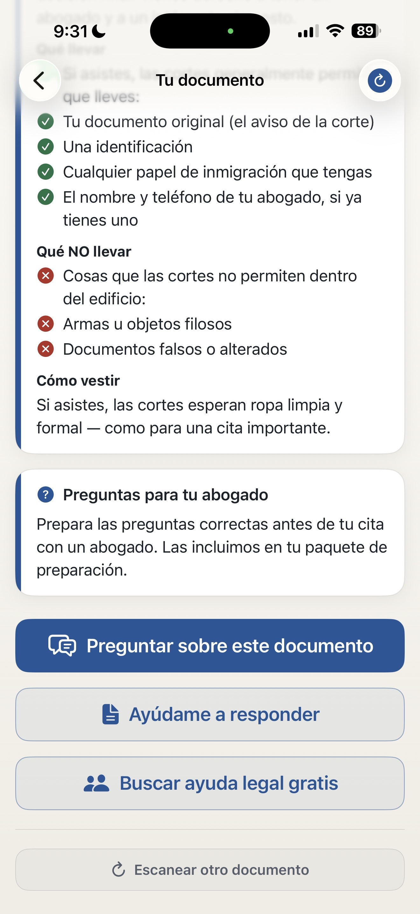<br/><sub>Four actions at the bottom of every scan: ask a question, generate the packet, find legal aid, or scan another document.</sub></td>
<td align="center" width="25%">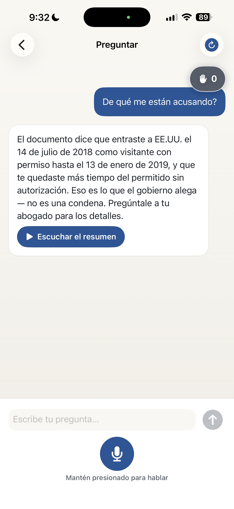<br/><sub>Factual questions get short, plain Spanish answers. Same chat as the refusal shot above; different question, different result.</sub></td>
<td align="center" width="25%">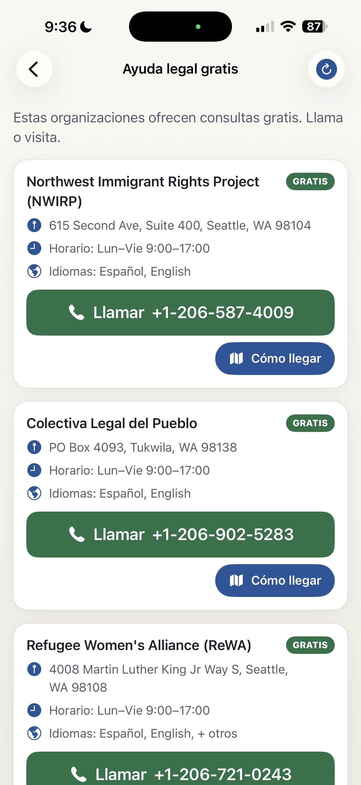<br/><sub>Free legal help. Three real Seattle organizations with their actual phone numbers and addresses.</sub></td>
</tr>
</table>

> Every other screen from the session lives in [`docs/screenshots/`](docs/screenshots/): splash, disclaimer, camera tips, camera confirm, both reading levels, refusal log, packet checklist, share sheet, and more.

---

## Status

This is a hackathon project, archived as-built and lightly polished for public reading.

- **Code:** complete, runs as demoed, MIT-licensed.
- **Hosted instance:** intentionally torn down. The deployed AWS stack was a hackathon-only resource; running a public legal-information service for vulnerable users requires obligations a solo project cannot meet (uptime, data handling, legal liability). To use the app, deploy your own (see below).

---

## What it does (60 seconds)

1. **Photograph** any English document (NTA, RFE, court notice, suspected notario scam SMS).
2. **OCR + redact.** Names, A-numbers, and addresses are stripped before any model call.
3. **Summarize** in plain Spanish or English at the chosen reading level, with four mandatory sections: *who sent it · what they say · your key dates · your rights*. The deadline gets its own urgency card on top of the section cards.
4. **Flag** scam patterns and explain them, with citations to FTC / USCIS advisories.
5. **Prepare** a Response Packet to take to a free legal-aid appointment.
6. **Refuse**, visibly, the moment a question becomes legal strategy. A counter in the corner shows every refusal. The refusals are the product, not a failure mode.

> **v1 known limitation:** the Ask chat (follow-up Q&A about the scanned document) always answers in Spanish, regardless of which language the user picked. The scan summary, urgency card, sections, court brief, refusal log, and Response Packet are all fully bilingual. Bilingual Ask responses are planned for v2.

---

## The four bright lines

Hard-coded in the prompts and surfaced in the UI:

1. **No legal advice.** The app refuses and routes to free legal aid.
2. **No judge analytics.** Ever.
3. **No outcome prediction** ("will I be deported?", "will I win?").
4. **PII redacted before any model call**, and the redaction is shown to the user.

Full rules: [`docs/TENETS.md`](docs/TENETS.md).

---

## Architecture (as built for the hackathon)

```
iPhone (SwiftUI)
    │  HTTPS, base64 JPEG ≤ 4.5MB
    ▼
API Gateway (HTTP API)
    │
    ▼
AWS Lambda (Python 3.12)
    ├── Amazon Textract        ── OCR (printed-document detection)
    ├── Amazon Bedrock         ── Claude Sonnet 4.6 (extraction + summary, JSON)
    ├── Amazon Polly           ── neural Spanish (Lupe) / English (Joanna) TTS
    ├── Amazon S3              ── ephemeral uploads, 1-hour TTL
    └── Amazon DynamoDB        ── PII-redacted refusal log
```

On-device per-card TTS uses Apple's `AVSpeechSynthesizer`. No network call, no AWS cost. Polly is reserved for the hero "summary" card.

Full diagrams and data flow: [`docs/ARCHITECTURE.md`](docs/ARCHITECTURE.md), [`docs/DIAGRAMS.md`](docs/DIAGRAMS.md).

---

## Deploy your own

The repo is the recipe. Bring an AWS account, you can have your own private instance running in ~15 minutes.

**Prerequisites**
- AWS CLI configured against your account (region `us-west-2`)
- AWS SAM CLI (`brew install aws-sam-cli`)
- Python 3.12
- Bedrock model access requested for **Anthropic Claude Sonnet 4.x** in `us-west-2`
- Xcode 16+ to build the iOS app

**Backend**
```bash
cd backend
make build && sam deploy --guided
```
Copy the `ApiBaseUrl` from the deploy output.

**iOS**
1. Open `CartaClara/CartaClara.xcodeproj` in Xcode.
2. Edit `CartaClara/CartaClara/Configuration.plist` and replace the `REPLACE_WITH_SAM_DEPLOY_OUTPUT` placeholder with your API URL.
3. Build to a device or simulator.

Detailed deploy notes, IAM caveats, and CloudWatch tips: [`backend/README.md`](backend/README.md).

---

## Repository layout

```
carta-clara/
├── CartaClara/          Xcode project (Swift + SwiftUI)
├── ios/                 mirror of the iOS sources (used by tooling)
├── backend/             SAM template, Lambdas, prompts, tests
├── kb-corpus/           curated source documents (FTC, USCIS, EOIR)
├── docs/                architecture, tenets, demo script, eval prompts
└── outreach/            templates used to validate with immigrant-services orgs
```

---

## Disclaimer

**Carta Clara is not legal advice.** It is an information tool that helps a non-English-speaker understand the surface of a document and find a qualified attorney. It is not a substitute for an immigration lawyer, an accredited representative, or any licensed professional. Decisions about your case should be made with a real human who has reviewed your actual documents.

This repo is the source code for a hackathon project. It is provided as-is, under the MIT License, with no warranty and no obligation of support, uptime, or future maintenance.

---

## License

MIT — see [`LICENSE`](LICENSE).

---

## Acknowledgments

Built for Seattle University × University of Washington AWS Hacks (May 2026). Thanks to the immigrant-services organizations whose materials shaped the refusal taxonomy and the scam-pattern citations.
