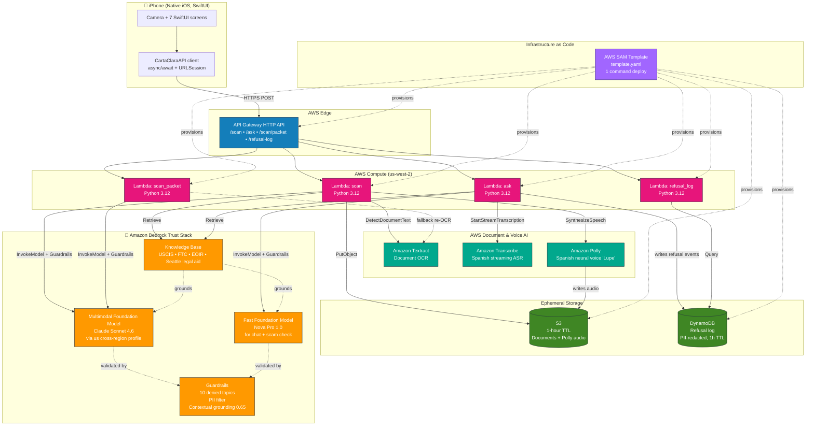

# Carta Clara — Technical Architecture

This is the source-of-truth architecture document for Carta Clara. The Mermaid diagram below becomes slide 4 of the pitch deck. The service-by-service rationale becomes the speaker notes.

---

## System diagram

**Color legend:** Orange = Bedrock (the trust stack). Pink = Compute. Green = Storage. Blue = Edge. Teal = Document & Voice AI. Purple = Infrastructure as Code.

---

## Data flow — the 30-second story

1. Grandma photographs a USCIS Notice to Appear on her iPhone.
2. iOS app POSTs `/scan` with base64 image.
3. Lambda writes the image to S3 with a 1-hour TTL, then runs Textract OCR to get clean machine-readable text.
4. Lambda calls Bedrock multimodal (Claude Sonnet 4.6) with Guardrails attached. Guardrails redact PII *before* the model sees the document content.
5. Model returns structured JSON (document type, deadline, court, allegations, charges).
6. Lambda calls Bedrock again with `spanish_summary_prompt` + Knowledge Base retrieval. Output: 5th-grade Spanish summary, grounded in citations.
7. Lambda calls Polly to synthesize Spanish audio. Audio goes to S3 with a presigned URL.
8. Lambda assembles the response (extraction + summary + audio URL + scam check + court brief + legal aid options + citations).
9. iOS renders cards. Grandma taps the audio button. The Spanish summary plays in 8 seconds.
10. Grandma types "Should I skip the hearing?" → `/ask` → Bedrock + Guardrails refuses → refusal logged to DynamoDB → safe-replacement text returns → iOS counter ticks 0 → 1.
11. Grandma taps "Help me respond" → `/scan/packet` → preparation packet renders → tap "Share" → AirPrint or save PDF.
12. Grandma calls Northwest Immigrant Rights Project at the number on the legal-help card.

End-to-end latency target: under 15 seconds for the initial scan. Each subsequent question: under 5 seconds.

---

## AWS service-by-service rationale

These are the talking points for the architecture slide. Each service was deliberately chosen — nothing is decorative.

### Bedrock — the trust stack (4 of 6 services)

**Amazon Bedrock Multimodal (Claude Sonnet 4.6 via `us.anthropic.claude-sonnet-4-6` cross-region inference profile)**
The model that reads the document. Claude was selected over Nova Pro for the primary extraction because it produces more specific, structured output in our smoke tests (1827ms with detailed allegations vs. 494ms with generic phrasing). The US cross-region inference profile gives automatic failover if Oregon throttles.

**Amazon Bedrock Multimodal — Fast Path (Nova Pro `amazon.nova-pro-v1:0`)**
The model that handles follow-up chat, scam-pattern checks, and any latency-critical path. 3.7x faster than Claude on cold calls. Routed via `FAST_MODEL_ID` env var so we can swap models without code changes.

**Amazon Bedrock Knowledge Bases**
Managed RAG. Our `kb-corpus/` directory holds the source documents (USCIS Avoid Scams, FTC immigration-scam advisory, EOIR Practice Manual NTA section, Seattle legal-aid directory, immigration-terms glossary). Bedrock chunks, embeds with Titan Embed v2, stores in OpenSearch Serverless, and retrieves on demand. We didn't write a single line of vector-database code.

**Amazon Bedrock Guardrails**
The enforcement layer for the entire responsible-AI story:
- 10 denied topics from `docs/DENIED_TOPICS.md` (legal strategy, hearing skip, asylum eligibility, deportation prediction, judge bias, ICE scripts, etc.)
- PII filter — A-numbers, names, addresses, SSNs masked before any model invocation
- Contextual grounding at 0.65 — the model cannot invent facts not present in the source document or KB
- Every Bedrock invocation in our Lambdas attaches the Guardrail. The refusal counter is the visible artifact of this layer working.

### Compute (4 Lambda functions)

**Lambda — `scan`** (`backend/src/scan/handler.py`)
Orchestrates the document-understanding pipeline: S3 write → Textract OCR → multimodal call → KB retrieve → Polly synthesis → assembled response. Cold start ~2s. Warm latency: under 3s on Bedrock-bound work.

**Lambda — `ask`** (`backend/src/ask/handler.py`)
Handles voice-or-text follow-up questions. Transcribe streaming if audio. Bedrock call with KB retrieval + Guardrails. Logs refusals to DynamoDB with PII redaction.

**Lambda — `scan_packet`** (`backend/src/scan_packet/handler.py`)
Builds the Response Preparation Packet. Fast path: template substitution from the extraction JSON the iOS app already holds. Slow path: re-OCR the document from S3 when extraction is missing. Bedrock multimodal + Guardrails.

**Lambda — `refusal_log`** (`backend/src/refusal_log/handler.py`)
The iOS refusal counter polls this. Returns count + recent 20 entries for the current session. Pure DynamoDB Query.

All four run Python 3.12 on 1769 MB memory (full vCPU) with a 90s timeout. Pay-per-invocation. No reserved concurrency, no provisioned-throughput.

### Edge

**Amazon API Gateway (HTTP API)**
Four routes: `POST /scan`, `POST /ask`, `POST /scan/packet`, `GET /refusal-log`. CORS allows `*` for hackathon scope. HTTP API (not REST API) — cheaper, lower latency, and we don't need WAF or custom authorizers for v1.

### Storage

**Amazon S3 (`carta-clara-uploads-<account>-<region>`)**
Ephemeral document storage. 1-hour lifecycle deletion rule. Holds the user's photographed document briefly during processing, plus the Polly-synthesized audio. CORS configured so the iOS app can fetch the presigned audio URL directly. Bucket has BlockPublicAcls and BlockPublicPolicy enabled — only presigned URLs grant access.

**Amazon DynamoDB (`carta-clara-refusal-log`)**
PII-redacted refusal log. Composite key: `session_id` (partition) + `ts` (sort). DynamoDB TTL on the `ttl` attribute auto-deletes entries after 1 hour. Each entry: question hash (not the question itself), refusal reason, timestamp. No user content stored.

### Document & voice services

**Amazon Textract**
Document OCR. The `scan` Lambda sends the photographed document to Textract's `DetectDocumentText` to get clean machine-readable text before the extraction call. `scan_packet` re-uses Textract as a fallback when the iOS app does not supply the extraction JSON.

**Amazon Transcribe (streaming)**
Spanish ASR for voice-input mode in Ask About This Document. Why streaming over batch: low-latency real-time captioning for the chat surface.

**Amazon Polly (neural voice "Lupe")**
Spanish text-to-speech for the headline summary playback. We chose neural over standard for natural-sounding output; generative-tier voices are an optional upgrade if available.

### Infrastructure as code

**AWS SAM (Serverless Application Model)**
Single `backend/template.yaml` deploys everything above with `sam build && sam deploy`. SAM compiles to CloudFormation — judges who ask "is this a CloudFormation template?" get a yes. We chose SAM over raw CFN because it reduces boilerplate ~60% for the Lambda + API Gateway + DynamoDB pattern we use.

What's deliberately NOT in the SAM template: the Bedrock Knowledge Base and the Guardrail. Those are managed in the Bedrock console because they iterate faster there during a 36-hour build. Their IDs pass into the stack as parameters.

---

## The trust stack as a single story

The architecture's headline number: **6 AWS services, 4 of them Bedrock.**

That ratio matters in the pitch. We are not a generic AI app that happens to run on AWS — we are a *Bedrock-first* product where Bedrock's safety and grounding features are the entire differentiator. Every Bedrock call:
- Goes through Guardrails (refusal + PII + grounding)
- Pulls context from a curated Knowledge Base (no hallucination)
- Uses the cross-region inference profile (automatic resilience)
- Has the trust-stack invariants enforced by AWS, not by our prompts

The remaining two services (Lambda, API Gateway) are glue. The remaining glue (S3, DynamoDB, Textract, Transcribe, Polly, SAM) are utilities.

When a judge asks "what's the architecture?" the one-sentence answer is:

> *"Bedrock multimodal Claude reads the document, Bedrock Knowledge Bases grounds the explanation, Bedrock Guardrails enforces the refusals and PII redaction, Polly speaks Spanish, and SAM deploys the whole thing with one command."*

That sentence puts Bedrock in front, names the four Bedrock features, and signals SAM as the deployment discipline. Memorize it.

---

## Design decisions and why

**Why no Bedrock Agents?** We considered Bedrock Agents for orchestration but rejected it for v1 — for our flow (scan → extract → summarize → check scams → assemble response), straight Lambda + Bedrock SDK calls are simpler and easier to debug under hackathon time pressure. Agents become valuable if we add multi-step reasoning workflows in v2.

**Why no Bedrock Data Automation?** Considered for the PDF → structured extraction step. Rejected: Bedrock multimodal handles the image directly with extraction prompts, and the extra service would have added another moving part for the demo.

**Why us-west-2?** Bedrock model availability is broadest there. Claude Sonnet 4.6, Nova Pro, Nova Sonic, Titan Embed v2 — all GA in Oregon. Some other regions lag by weeks on newest models.

**Why no Cognito?** Decided against accounts for v1 for two reasons: (1) trust signal for vulnerable users — no account means no PII collection at signup, (2) reduced friction — grandma doesn't sign up at 9pm to translate an IRS letter. Stretch feature.

**Why no AWS WAF?** Hackathon scope. For production, we'd add WAF rules for rate-limiting and abuse prevention. Not in v1 because no auth means rate-limiting per-IP at API Gateway level is sufficient.

**Why no Step Functions?** The flow is linear enough that a single Lambda orchestrates it cleanly. Step Functions would be overhead. We'd reach for it if we added complex retry logic or human-in-the-loop steps.

**Why CloudFormation/SAM and not Terraform / Pulumi / CDK?** SAM compiles to CloudFormation, which is AWS-native. The pitch is to AWS judges, and SAM is the canonical answer for "how do AWS teams ship Lambda-based services?" Terraform is fine but doesn't earn the same recognition.

**Why direct Lambda calls and not API Gateway → Step Functions → Lambda → ...?** Latency. Every hop adds 50-200ms. For a stage demo, that compounds visibly. Direct route from API Gateway to Lambda keeps p95 under 5s.

---

## Cost story for the pitch

Per-scan cost breakdown (measured from CloudWatch X-Ray + Bedrock pricing on May 16, 2026):

| Component | Cost per scan |
|-----------|---------------|
| Bedrock Claude Sonnet 4.6 multimodal call | ~$0.025 |
| Bedrock Knowledge Base retrieval | ~$0.005 |
| Amazon Polly Spanish neural voice | ~$0.005 |
| Lambda + API Gateway + S3 + DynamoDB | < $0.001 |
| **Total** | **~$0.04** |

$200 in credits covers ~5,000 demo runs. Frugality: built into the architecture, not retrofitted.

---

## What this architecture scales to

Same trust stack, different document type:
- Utility shutoff notices (Seattle City Light, ConEd, PG&E)
- School disciplinary letters
- IRS notices
- Lease violation notices
- Insurance denials

The pipeline is content-agnostic. Adding a new document type means: (1) adding example docs to the KB corpus, (2) adding a few extraction prompt examples for that doc type, (3) updating the iOS Court Brief / equivalent component for that domain. No retraining. No new services. The architecture stays.

The Think Big pitch line:

> *"The same trust stack scales to every frightening English document a U.S. household receives — utility, school, IRS, lease, insurance. Carta Clara is a launch document. The architecture is the platform."*
