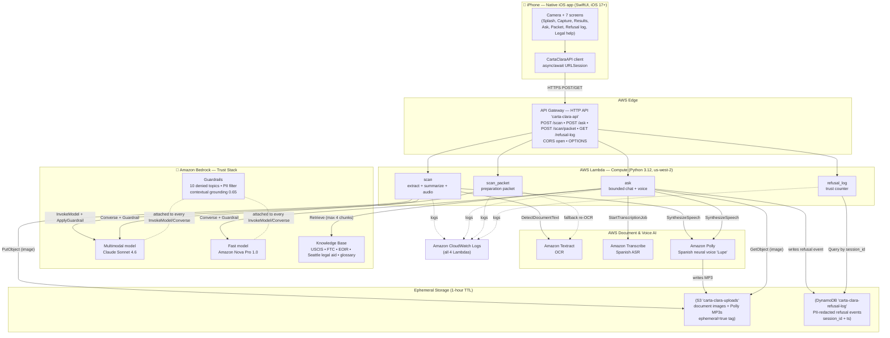
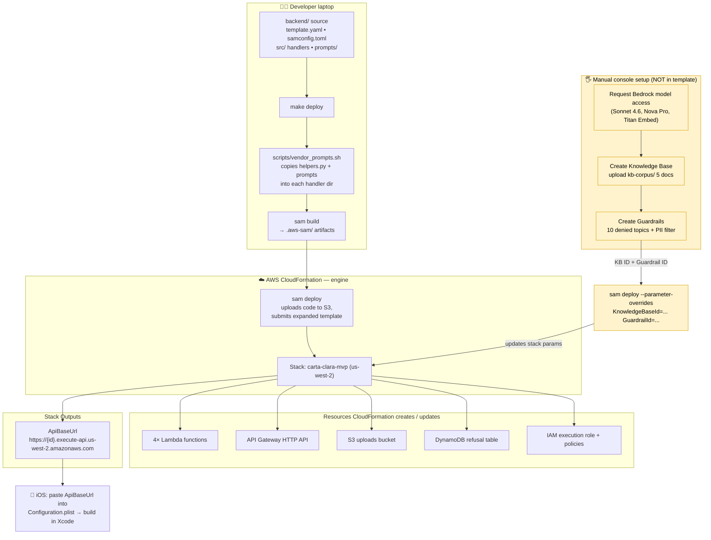
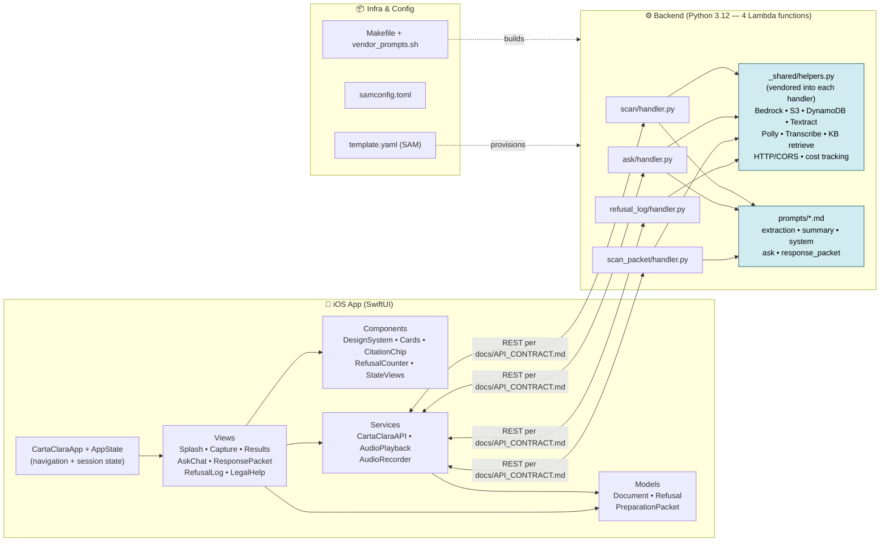
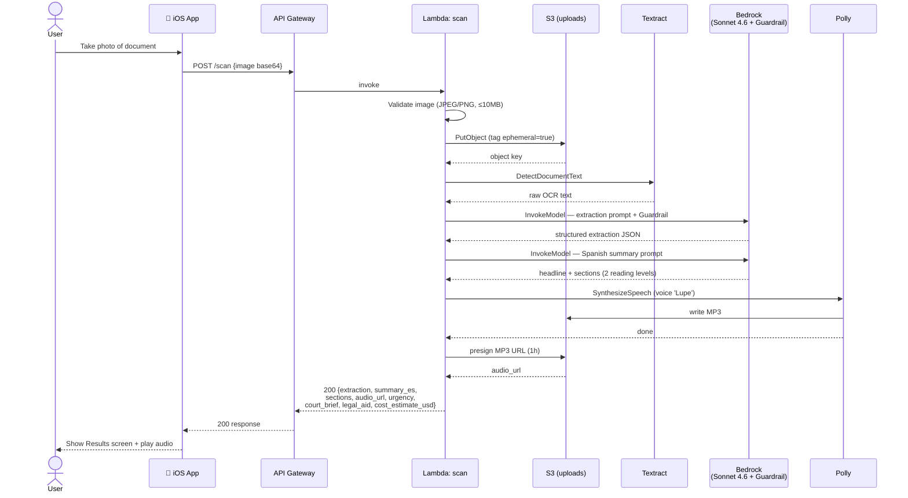
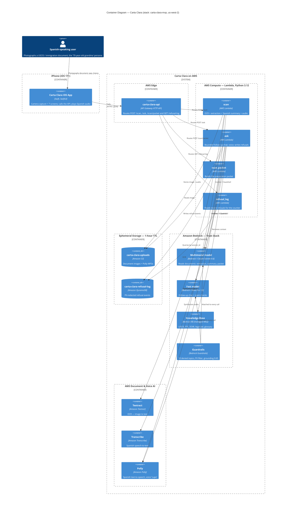

# Carta Clara — Architecture, Deployment & Component Diagrams

> **Why this doc exists:** The team was unclear on what CloudFormation is and how Carta Clara uses it. This doc answers that in plain language, then gives three diagrams: **Architecture** (what talks to what at runtime), **Deployment** (how the cloud gets built), and **Component** (what's inside the app and backend).
>
> Diagrams are Mermaid — they render in GitHub, VS Code (with the Mermaid extension), and most Markdown viewers.

---

## 1. What is CloudFormation? (Read this first)

**CloudFormation is AWS's "infrastructure as code" service.** Instead of clicking around the AWS web console to create a Lambda function, an S3 bucket, a database, etc. — you write a single text file that *describes* everything you want, and AWS builds it all for you.

Think of it like this:

| Without CloudFormation | With CloudFormation |
|------------------------|---------------------|
| Open AWS console, click "Create Lambda", fill 12 fields, repeat 4× | Write what you want once in `template.yaml` |
| Create the S3 bucket by hand, set permissions by hand | Same file describes the bucket and permissions |
| Teammate's environment never quite matches yours | Everyone runs the same file → identical setup |
| No record of what exists or why | The file *is* the record, tracked in git |

**A CloudFormation "stack"** is the bundle of all the AWS resources created from one template. Carta Clara's stack is named **`carta-clara-mvp`**. Delete the stack → every resource it created is cleanly torn down. No orphans, no surprise bills.

### Where SAM fits in

We don't write raw CloudFormation — we use **AWS SAM (Serverless Application Model)**. SAM is a *shorthand* on top of CloudFormation built for serverless apps. The line `Transform: AWS::Serverless-2016-10-31` at the top of `template.yaml` tells AWS: "expand my short SAM syntax into full CloudFormation before deploying."

- You write **~20 lines** of SAM for a Lambda + its API route + its permissions.
- SAM expands that into **~100 lines** of CloudFormation behind the scenes.
- `sam build` packages the code; `sam deploy` hands the expanded template to CloudFormation, which does the actual provisioning.

**One-line summary for the team:** `template.yaml` is our infrastructure blueprint. SAM is the shorthand we write it in. CloudFormation is the AWS engine that reads the blueprint and builds the real cloud. The result is a "stack" — and `carta-clara-mvp` is ours.

### What is and isn't in the template

| In `template.yaml` (CloudFormation builds it) | NOT in the template (created manually in AWS console) |
|-----------------------------------------------|-------------------------------------------------------|
| 4 Lambda functions | Bedrock Knowledge Base |
| API Gateway HTTP API + routes | Bedrock Guardrails |
| S3 uploads bucket | Bedrock model access approvals |
| DynamoDB refusal table | — |
| IAM execution role + policies | — |

> ⚠️ **This split is the #1 source of confusion.** The Knowledge Base and Guardrails are created by hand in the console, then their IDs are pasted into the stack as **parameters**. Until you do that, the template ships with `PLACEHOLDER` values. See the Deployment diagram below.

---

## 2. Architecture Diagram — what talks to what at runtime

This is the *running system*. A user takes a photo; here's every hop the request makes.



**How to read it:** Solid arrows = a call made on every request. Dotted arrows = conditional/fallback paths (e.g. `scan_packet` only re-runs OCR if the iOS app didn't send the extraction JSON). Guardrails aren't a separate hop — they're *attached to* every Bedrock model call, which is why they're drawn as dotted attachments.

---

## 3. Deployment Diagram — how the cloud gets built

This is **not** the runtime. This is the build/release process — and it's where CloudFormation actually does its job. Carta Clara has **no CI/CD pipeline**; deployment is a manual SAM CLI flow run from a developer laptop.



**The deployment sequence in words:**

1. **Vendor** — `vendor_prompts.sh` copies the canonical `helpers.py` and prompt files into each of the 4 handler folders (Lambda can't share code across folders without this).
2. **Build** — `sam build` installs Python deps and stages each function into `.aws-sam/`.
3. **Deploy** — `sam deploy` expands the SAM template to full CloudFormation, uploads the zipped code to a deploy bucket, and submits it to **CloudFormation**.
4. **Provision** — CloudFormation diffs the template against the existing `carta-clara-mvp` stack and creates/updates only what changed. First run creates everything; later runs are incremental.
5. **Manual one-time setup** (yellow) — Knowledge Base and Guardrails are built by hand in the console because SAM/CloudFormation doesn't support them well yet. Their IDs are fed back into the stack via `--parameter-overrides`.
6. **Wire the app** — Copy the `ApiBaseUrl` stack output into `ios/Configuration.plist`, then build the iOS app in Xcode.

**Teardown:** `sam delete` (or deleting the stack in the console) removes resources R1–R5 in one shot. The manual Bedrock resources (yellow) must be deleted by hand.

---

## 4. Component Diagram — what's inside the app and backend

Architecture shows *services*; this shows the *code modules* inside the two big boxes and how they depend on each other.



**Key things the team should notice:**

- **`helpers.py` is vendored, not imported.** There is *one* canonical copy at `src/_shared/helpers.py`. The build script copies it into all 4 handler folders. **Never edit the copies** — edit the canonical file, then re-run `make build`.
- **The iOS↔backend contract is `docs/API_CONTRACT.md`.** iOS `Models/` and the Lambda response shapes must match it exactly. Change one side → change the contract → change the other side.
- **Prompts live in `backend/prompts/`** and are vendored at build time, same as helpers.
- **`refusal_log` has no prompts** — it's a pure DynamoDB read, no model call.

---

## 5. Sequence Diagrams — what happens, step by step, over time

The diagrams above show *structure*. These show *time* — the exact order of calls for a single request. Two flows are covered: **`/scan`** (the core path) and **`/ask`** (which includes the Guardrail refusal branch).

### 5a. `/scan` — user photographs a document



### 5b. `/ask` — user asks a follow-up question (incl. refusal branch)

```mermaid
sequenceDiagram
    actor User
    participant iOS as 📱 iOS App
    participant API as API Gateway
    participant L as Lambda: ask
    participant S3 as S3 (uploads)
    participant TR as Transcribe
    participant KB as Bedrock KB
    participant BR as Bedrock<br/>(Nova Pro + Guardrail)
    participant DDB as DynamoDB<br/>(refusal log)

    User->>iOS: Ask question (text or voice)
    iOS->>API: POST /ask {session_id, document_id,<br/>question | audio}
    API->>L: invoke
    L->>L: Validate session_id + document_id

    opt Voice input
        L->>TR: StartTranscriptionJob
        Note over L,TR: bounded 22s poll;<br/>degrades to "please type" if slow
        TR-->>L: Spanish transcript
    end

    L->>S3: GetObject (original document image)
    alt Image expired (>1h TTL)
        S3-->>L: 404
        L-->>iOS: 404 — session expired, re-scan
    else Image present
        S3-->>L: image bytes
        L->>KB: Retrieve (max 4 chunks)
        KB-->>L: citations + context
        L->>BR: Converse — question + KB context<br/>+ image, Guardrail attached

        alt Guardrail intervenes (denied topic / PII)
            BR-->>L: BLOCKED
            L->>DDB: PutItem (PII-redacted refusal event)
            L-->>iOS: 200 {refused:true, safe_text,<br/>escalation to legal aid}
            iOS-->>User: Show refusal + legal-aid referral
        else Allowed
            BR-->>L: Spanish answer
            L-->>iOS: 200 {answer_es, citations,<br/>audio_url?, cost_estimate_usd}
            iOS-->>User: Show answer + citations
        end
    end
```

**How to read these:** `opt` = optional block (runs only for voice input). `alt`/`else` = branching — exactly one path runs. The refusal branch in 5b is the trust mechanic: a blocked answer is *logged* and *counted*, never silently dropped — that's what the visible refusal counter in the app reflects.

> **Not diagrammed:** `/scan/packet` (preparation packet — fast path is template substitution from the extraction JSON the app already holds; slow path re-OCRs from S3) and `/refusal-log` (a plain DynamoDB `Query` by `session_id`, no model call). Both are simple enough that the component diagram covers them. Ask if you want either drawn.

---

## 6. Container Diagram (C4 Level 2)

> **What "container" means here:** In the **C4 model** of software diagrams, a *container* is **not** a Docker container. It means **a separately deployable or runnable thing** — an app, an API, a database, a serverless function, a managed cloud service. This diagram takes the grouped boxes from `docs/ARCHITECTURE.md` (iPhone, AWS Edge, Compute, Storage, Bedrock, Voice) and renders them as formal C4 containers, showing the technology and responsibility of each.
>
> In C4 terms: §2 Architecture ≈ the Context view, **this is the Container view**, and §4 Component is the Component view.



**Notes for the team:**

- **One container per ARCHITECTURE.md box**, expanded to runtime detail. Each container shows `[name | technology | responsibility]` — standard C4 format.
- **SAM / `template.yaml` is intentionally NOT here.** A container diagram shows the *running* system; SAM is a build-time tool, not a runtime container. It belongs in the Deployment diagram (§3), where it already is.
- **Two corrections vs. the ARCHITECTURE.md diagram** (which is stale — flagged separately): this diagram includes the 4th Lambda **`scan_packet`** and the **Textract** container. The ARCHITECTURE.md diagram still shows only 3 Lambdas and omits Textract. This C4 diagram and the rest of `DIAGRAMS.md` reflect the real system in `template.yaml` and the handler code.
- **Guardrails** is drawn as its own container with relationships into both models — because in C4, "attached to every model call" is a relationship worth making explicit.

---

## Quick reference

| Term | What it means here |
|------|--------------------|
| **CloudFormation** | AWS engine that reads a template and builds/destroys cloud resources |
| **SAM** | Shorthand syntax for CloudFormation, optimized for serverless |
| **`template.yaml`** | Our infrastructure blueprint (4 Lambdas, API GW, S3, DynamoDB, IAM) |
| **Stack** | The named bundle of resources from one template → `carta-clara-mvp` |
| **`sam build`** | Packages handler code + deps into `.aws-sam/` |
| **`sam deploy`** | Expands SAM → CloudFormation, uploads code, provisions the stack |
| **Parameters** | Values fed into the stack at deploy time (KB ID, Guardrail ID, model IDs) |
| **Outputs** | Values the stack reports back — we use `ApiBaseUrl` |
| **Vendoring** | Copying `helpers.py` + prompts into each handler folder before build |

---

*Source of truth for resource details: `backend/template.yaml`, `backend/samconfig.toml`, `docs/API_CONTRACT.md`. Last updated 2026-05-16.*
